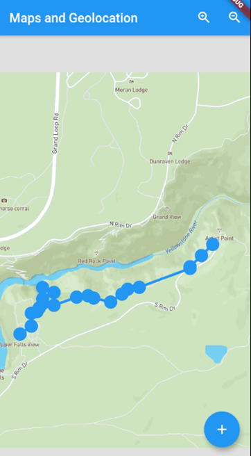

# Lab 09/10
The starter code for lab 09/10.

## Overview
For this lab, you will develop a simple fitness tracking app.  The user will be able to record points, and see a map of those recorded points updated in real time.

_**Note:** This lab is designed to take 2 weeks, and will be worth the value of two lab assignments.  It is recommended that you develop the map interface in the first week, using placeholder data (e.g. an array of locations).  You can implement the geolocation and geocoding functionality in the second week._

## Instructions
The floating action button will cause the current location to be recorded, and its address/location name looked up using geocoding.  A `FlutterMap` will display all recorded points, both as a polyline connecting them (in order), and using a map marker.

### The Map
First, you will need a class to store the data for the stored points (`Location`):
- `name` (`String` place name, using geocoding)
- `address` (`String` street number and street name, using geocoding)
- `latlng` (using the `LatLng` class, storing the geolocation coordinates)

Create a placeholder array of such `Location` objects, and use that for the data for your map's polyline and markers.

Optionally, you can create a set of icon buttons on the app bar to zoom in/out, using the `mapController`.  You can use the CTRL key and the mouse to zoom, but this may be easier to control.  This was done in the screenshot, below, but isn't required for full marks.

The `FlutterMap` will have 3 main components:
- options which will set the max and min zoom levels
- mapController which can update the centre of the map programmatically
    - https://pub.dev/documentation/flutter_map/latest/flutter_map/MapController-class.html 
- layers which will have the following layers:
    - `TileLayerOptions` - this will be configured to use a MapBox API (use your own token)
    - `MarkerLayerOptions` - this will generate a list of `Marker` instances, one for each location
    - `PolylineLayerOptions` - this will generate a single `Polyline` instance, consisting of the stored location points

### Creating the Data
The floating action button for the app will do the following:
- Use the geolocator plug-in to get the current position
- Use the geolocator plug-in to obtain the placemark for the current position, which will contain:
    - `name`:  `placemark.name`
    - `address`:  `placemark.subThoroughfare`, a space, then `placemark.thoroughfare`
- Create a new instance of Location
- Add this new Location to the list

The data should now be dynamic.  You can enter different GPS coordinates using the settings of the emulator, if you want to test it out.  You can also download and use a GPX/KML file, which contains a list of geolocation coordinates.  This is what was done for the screenshot.  Alternatively, you can use a physical device.

One such file, representing a hike through the wilderness, can be found in this repository:
- `data/cedar_valley.gpx`

_Figure 1 - A screenshot of the app, showing the map, the floating action button, and the app bar icons_

## Getting Help
If you run into difficulty, you may wish to check out some of the following resources:

- https://api.flutter.dev/  - The standard documentation for Flutter, all classes and methods.
- https://dart.dev/tutorials - A series of tutorials for the Dart programming language, focusing entirely on the features of Dart.
- https://flutter.dev/docs/reference/tutorials - A series of tutorials for the Flutter platform, focusing mainly on the widgets and API.
- https://flutter.dev/docs/codelabs - A series of deep-dive, more comprehensive, tutorials to learn more about the Flutter platform.
- https://flutter.dev/docs/cookbook - A set of recipes for commonly used features of Flutter.
- https://github.com/flutter/samples/ - A repository containing some completed Flutter applications.
- http://stackoverflow.com/ - A forum for asking questions about programming.  I bet you know this one already!

Of course, you can always ask the TA for help!  However, learning how to find the answers out for yourself is not only more satisfying, but results in greater learning as well.

## How to Submit
Create your flutter project inside this folder, commit, and then push your code to this repository to submit your lab assignment.

## Extending
To extend this lab, you will need to add some additional features:

- If you haven't already, create a set of icon buttons on the app bar to zoom in/out, using the `mapController`.

- Add a button to the appBar that, when generating the `Polyline`, instead of connecting markers in the order in which they were generated, creates a graph of the shortest path to each marker starting from the marker closest to the device's current location.

- Add a new value associated with each marker which indicates that point's elevation. Then, draw a rudimentary heatmap over the map based on that value for each marker, where 'high' values are 'hot' and 'low' values are 'cold'.  One way to do this is to draw a very small square at each grid coordinate, where the opacity of the square is proportional to the value for that location.  However, for this heatmap to look anywhere decent, the granularity of the grid needs to be pretty small.  This one is a bit tricky, but it is possible to draw basic shapes on a map overlay. If you don't like the appearance, you can use a color palette instead (red for hot/high values, blue for cold/low values).

- Add a new value associated with each marker which indicates a timestamp. Then, add a button that generates the polyline to connect each marker in timestamp order. Next, color each line between markers based on the average speed in that interval (green = fastest speed between markers, red = slowest).
